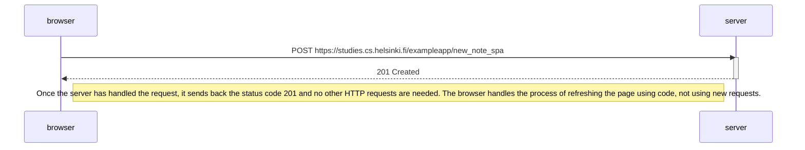

```mermaid
sequenceDiagram
    participant browser
    participant server

    browser->>server: POST https://studies.cs.helsinki.fi/exampleapp/new_note_spa
    activate server
    server-->>browser: 201 Created
    deactivate server

    Note right of browser: Once the server has handled the request, it sends back the status code 201 and no other HTTP requests are needed. The browser handles the process of refreshing the page using code, not using new requests.
```
